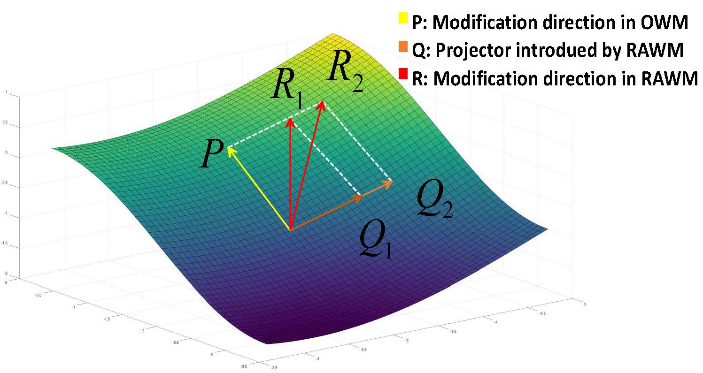

# RAWM
This is the official project of the Regularized Adaptive Weight Modification (RAWM) method proposed by our paper titled 'Do You Remember? Overcoming Catastrophic Forgetting for Fake Audio Detection' published on the 40th International Conference on Machine Learning (ICML 2023).
## Citation

If you find this toolkit useful, please consider citing following papers.
```
@InProceedings{pmlr-v202-zhang23au,
  title = 	 {Do You Remember? {O}vercoming Catastrophic Forgetting for Fake Audio Detection},
  author =       {Zhang, Xiaohui and Yi, Jiangyan and Tao, Jianhua and Wang, Chenglong and Zhang, Chu Yuan},
  booktitle = 	 {Proceedings of the 40th International Conference on Machine Learning},
  pages = 	 {41819--41831},
  year = 	 {2023},
  editor = 	 {Krause, Andreas and Brunskill, Emma and Cho, Kyunghyun and Engelhardt, Barbara and Sabato, Sivan and Scarlett, Jonathan},
  volume = 	 {202},
  series = 	 {Proceedings of Machine Learning Research},
  month = 	 {23--29 Jul},
  publisher =    {PMLR},
  pdf = 	 {https://proceedings.mlr.press/v202/zhang23au/zhang23au.pdf},
  url = 	 {https://proceedings.mlr.press/v202/zhang23au.html}
}

```
```
@article{zhang2023remember,
  title={What to remember: Self-adaptive continual learning for audio deepfake detection},
  author={Zhang, Xiaohui and Yi, Jiangyan and Wang, Chenglong and Zhang, Chuyuan and Zeng, Siding and Tao, Jianhua},
  journal={arXiv preprint arXiv:2312.09651},
  year={2023}
}
```
### Introduction 
we propose a continual learning algorithm to overcome catastrophic forgetting, named Regularized Adaptive Weight Modification (RAWM). When fine-tuning a nerual network on specific task, like fake audio detection, our approach adaptively computes the direction of weight modification according to the ratio of genuine utterances and fake utterances. The adaptive modification direction ensures the network can effectively detect fake audio on the new dataset while preserving its knowledge of old model, thus mitigating catastrophic forgetting. In addition, genuine audio collected from quite different acoustic conditions may skew their feature distribution, so we introduce a regularization constraint to force the network to remember the old distribution in this regard. Our method can easily be generalized to related fields, like image recognition.

### For training experiment, run 
```
  python train.sh --yaml
```
An example would be: 
```
  python train.sh clear10/clear10_feature_resnet50_moco.yaml
```
### For parsing metric, run
```
python parse_log_to_result.py --split --verbose[to print out the result matrix as well] --move[move to main server to plot] 
```
An example would be: 
```
python parse_log_to_result.py --split clear100_feature_resnet50_moco --verbose 1 --move 1
```
### The code is based on the official code of the CLEAR benchmark
This project include the RAWM mentioned in our paper that (re)produced by us.
