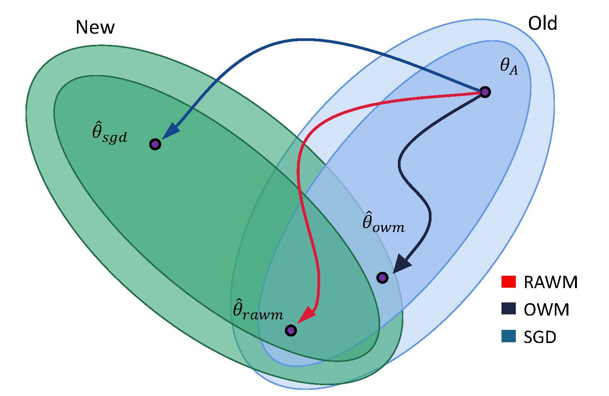

# RAWM
### We are pleased to announce that our paper titled 'Do You Remember? Overcoming Catastrophic Forgetting for Fake Audio Detection' has been accepted for the 40th International Conference on Machine Learning (ICML 2023).
The official project of the Regularized Adaptive Weight Modification (RAWM) method for continual learning
### Introduction 
we propose a continual learning algorithm to overcome catastrophic forgetting, named Regularized Adaptive Weight Modification (RAWM). When fine-tuning a nerual network on specific task, like fake audio detection, our approach adaptively computes the direction of weight modification according to the ratio of genuine utterances and fake utterances. The adaptive modification direction ensures the network can effectively detect fake audio on the new dataset while preserving its knowledge of old model, thus mitigating catastrophic forgetting. In addition, genuine audio collected from quite different acoustic conditions may skew their feature distribution, so we introduce a regularization constraint to force the network to remember the old distribution in this regard. Our method can easily be generalized to related fields, like image recognition.

### The code is based on the official code of the CLEAR benchmark
This project include the RAWM and OWM method mentioned in our paper, both of them are (re)produced by us.

The data preparation, training, and testing command is as same as that in the official code of the CLEAR benchmark, and we will update them in future. 
